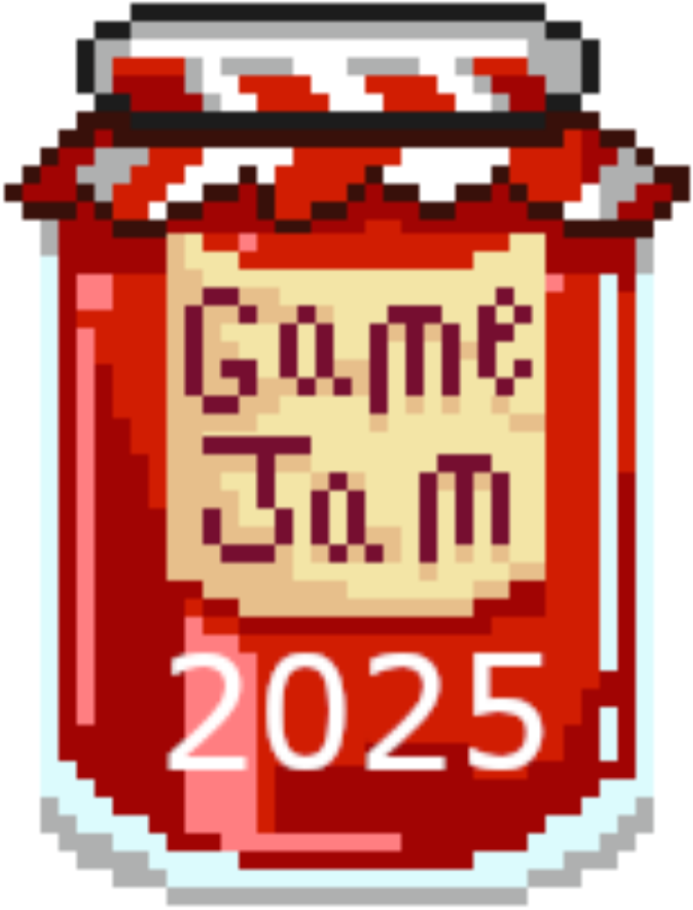

<div style="display: flex; align-items: end; justify-content: center; gap: 15px">
    
    <h1> GameJam 2025</h1>
</div>
<hr>


Nous participons à la Game Jam 2025. Il s'agit d'une semaine de programmation 
d’un jeu en 2D avec le langage Python et la bibliothèque PyGame. Le but de cette 
semaine de programmation est favorisé les rencontres entre nous,
de nous construire une nouvelle expérience de travail en groupe,
et de nous donner une nouvelle expérience de programmation en Python. \
Nous devrons assurer la conception et la réalisation d'un jeux style « rétro game »
et le présenter.

## 📦 Installation

```bash
git clone https://github.com/sogata-aw/GameJamIUT.git
cd GameJamIUT
virtualenv -p python3 .env
source .env/bin/activate
pip3 install -r requirements.txt
```

## 🕹️ Lancer le jeu

```bash
python3 main.py
```
## 📝 Présentation

- Aline ROSTAGNAT - *Cheffe de projet*
- Nils RAYOT - *Développeur*
- Thomas REYMOND - *Développeur*
- Maxime RASTELLI - *Game Artist* 🎨